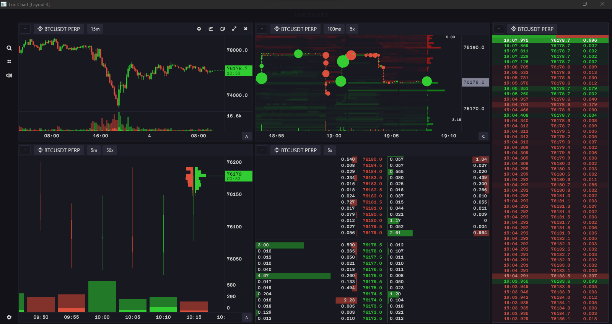

# LUX CHART - Advanced Trading Analytics Platform

[](https://github.com/parvezahmmedmahir/footprint/blob/main/LICENSE)
[](https://github.com/iced-rs/iced)
[](https://www.rust-lang.org/)

A powerful, open-source desktop charting and market analysis application built with Rust. Supports real-time data from **Binance**, **Bybit**, **Hyperliquid**, and **OKX** exchanges.

<div align="center">
  
</div>

---

## 🚀 Key Features

### 📊 Multiple Chart Types

#### **Heatmap (Historical Depth of Market)**
- Real-time visualization of order book depth and trade flow
- Time-series heatmap showing market liquidity and trade activity
- Customizable price grouping and aggregation intervals
- Volume profile analysis (fixed window or visible range)
- Trade size filtering and order size filtering
- Advanced noise reduction with order coalescing
- Dynamic circle radius scaling for trade visualization
- Support for multiple heatmap studies and overlays

#### **Footprint Charts**
- Price-grouped interval aggregation of trades over candlesticks
- Multiple cluster visualization modes:
  - **Bid/Ask Clusters**: Separate buy and sell volumes
  - **Volume Profile**: Total volume at each price level
  - **Delta Profile**: Net buying/selling pressure
- Configurable cluster scaling:
  - Visible Range: Scale based on visible candles
  - Hybrid: Blend global and per-candle scaling
  - Per-Candle: Individual candle normalization
- Advanced studies:
  - **Naked Point of Control (NPoC)**: Identifies unfilled high-volume nodes
  - **Imbalance Detection**: Highlights significant order flow imbalances
  - Configurable lookback periods and thresholds
- Support for both time-based and tick-based intervals

#### **Candlestick Charts**
- Traditional OHLC candlestick visualization
- Time-based intervals (1m, 5m, 15m, 1h, 4h, 1D, etc.)
- Custom tick-based intervals for precise analysis
- Multiple technical indicators support
- Clean, professional rendering

#### **Time & Sales Panel**
- Real-time scrollable trade feed
- Trade size filtering (customizable threshold)
- Configurable trade retention period (1-60 minutes)
- Optional stacked bar visualization:
  - **Compact Mode**: Space-efficient display
  - **Full Mode**: Detailed breakdown
  - Multiple metrics: Volume, Trade Count, Buy/Sell Ratio
- Color-coded buy/sell identification
- Timestamp display with timezone support

#### **DOM (Depth of Market) / Ladder**
- Live Level 2 order book visualization
- Recent trade volumes overlaid on price levels
- Configurable price grouping/aggregation
- Display options:
  - Spread indicator
  - Chase tracker (momentum visualization)
- Trade retention settings (1-60 minutes)
- Real-time order book updates

#### **Comparison Charts**
- Multi-asset line graph comparison
- Percentage-based normalization
- Synchronized timeframes across assets
- Custom series colors and labels
- Support for multiple exchanges simultaneously

### 🎨 Advanced Customization

- **Multi-Window Support**: Pop out charts to multiple monitors
- **Pane Linking**: Synchronize ticker selection across multiple panes
- **Persistent Layouts**: Save and restore custom workspace configurations
- **Theme Editor**: Full color palette customization
  - Built-in themes (Dark, Light, and custom variants)
  - Per-element color control
  - Real-time preview
- **Flexible Workspace**: Resizable, draggable, and splittable panes
- **Timezone Support**: UTC or Local time display

### 🔊 Real-Time Audio Alerts

- Trade-driven sound effects
- Configurable volume levels
- Multiple sound profiles
- Threshold-based triggers

### 📈 Technical Indicators

#### Kline/Footprint Indicators:
- **Volume**: Traditional volume bars
- **Open Interest**: Futures contract tracking (supported exchanges)
- **CVD (Cumulative Volume Delta)**: Net buying/selling pressure
- **VWAP (Volume Weighted Average Price)**: Intraday benchmark
- **Custom Studies**: Extensible indicator framework

#### Heatmap Studies:
- **Volume Profile**: Fixed window or visible range
- **Custom Overlays**: Configurable study parameters

### 🌐 Exchange Support

| Exchange | Spot | Futures | Historical Trades | Tick Data |
|----------|------|---------|-------------------|-----------|
| **Binance** | ✅ | ✅ | ✅ (REST + Bulk) | ✅ |
| **Bybit** | ✅ | ✅ | ❌ | ✅ |
| **Hyperliquid** | ✅ | ✅ | ❌ | ✅ |
| **OKX** | ✅ | ✅ | 🚧 WIP | ✅ |

### 📡 Data Sources

- **WebSocket Streams**: Real-time trade and order book data
- **REST APIs**: Historical kline data and market information
- **Binance Data Vision**: Fast bulk historical trade downloads
- **Direct Exchange Integration**: No third-party data providers

---

## 💾 Installation

### Method 1: Prebuilt Binaries (Recommended)

Download the latest release for your platform from the [Releases page](https://github.com/parvezahmmedmahir/footprint/releases).

<details>
<summary><strong>Troubleshooting Security Warnings</strong></summary>

Since binaries are currently unsigned, you may encounter security warnings:

- **Windows**: Click "More info" → "Run anyway" on the SmartScreen prompt
- **macOS**: Right-click the app → "Open", or go to System Settings → Privacy & Security
- **Linux**: Make the file executable: `chmod +x lux-chart`

</details>

### Method 2: Build from Source

#### Prerequisites

- [Rust toolchain](https://www.rust-lang.org/tools/install) (1.70+)
- [Git](https://git-scm.com/)
- Platform-specific dependencies:

**Linux:**
```bash
# Debian/Ubuntu
sudo apt install build-essential pkg-config libasound2-dev

# Arch Linux
sudo pacman -S base-devel alsa-lib

# Fedora
sudo dnf install gcc make alsa-lib-devel
```

**macOS:**
```bash
xcode-select --install
```

**Windows:**
No additional dependencies required

#### Build Instructions

```bash
# Clone the repository
git clone https://github.com/parvezahmmedmahir/footprint.git
cd footprint

# Build and run (development)
cargo run

# Build optimized release
cargo build --release
./target/release/lux-chart
```

#### Install Globally

```bash
cargo install --path .
lux-chart
```

---

## 🎯 Usage Guide

### Quick Start

1. **Launch the application**
2. **Select an exchange** from the sidebar
3. **Search for a ticker** (e.g., BTCUSDT)
4. **Choose a chart type** (Heatmap, Footprint, Candlestick, etc.)
5. **Customize settings** via the gear icon

### Keyboard Shortcuts

- `ESC`: Close modals/go back
- `Ctrl/Cmd + Mouse Wheel`: Zoom in/out on charts
- `Middle Mouse Drag`: Pan chart horizontally
- `Right Click`: Context menu (on supported elements)

### Advanced Features

#### Pane Linking
1. Click the link icon on a pane
2. Select a color group
3. All panes in the same group will switch tickers together

#### Layout Management
1. Open Settings → Layouts
2. Create, rename, or delete custom layouts
3. Switch between layouts instantly

#### Historical Trade Fetching (Binance)
1. Open Settings
2. Enable "Fetch Historical Trades"
3. Choose data source (Bulk or REST API)
4. Trades will backfill automatically when viewing footprint charts

---

## 🛠️ Configuration

### Data Storage

Application data is stored in:
- **Windows**: `%APPDATA%\lux-chart\`
- **macOS**: `~/Library/Application Support/lux-chart/`
- **Linux**: `~/.local/share/lux-chart/`

### Settings Files

- `config.json`: Application settings
- `layouts/`: Saved workspace layouts
- `themes/`: Custom color themes
- `market_data/`: Cached historical data

---

## 🔧 Technical Details

### Architecture

- **Language**: Rust (safe, fast, concurrent)
- **GUI Framework**: [iced](https://github.com/iced-rs/iced) (reactive, cross-platform)
- **Rendering**: GPU-accelerated with wgpu
- **Networking**: Async WebSocket and HTTP clients
- **Data Processing**: Zero-copy deserialization with serde

### Performance

- **Low Latency**: Direct WebSocket connections
- **Efficient Memory**: Rust's ownership model prevents leaks
- **Smooth Rendering**: 60+ FPS chart updates
- **Concurrent Processing**: Multi-threaded data handling

---

## 🤝 Contributing

Contributions are welcome! Please feel free to submit issues or pull requests.

### Development Setup

```bash
# Run with debug logging
RUST_LOG=debug cargo run

# Run tests
cargo test

# Format code
cargo fmt

# Lint code
cargo clippy
```

---

## 📜 License

This project is licensed under the **GNU General Public License v3.0** - see the [LICENSE](LICENSE) file for details.

---

## 🙏 Credits

- **[Kraken Desktop](https://www.kraken.com/desktop)** (formerly Cryptowatch): Primary inspiration
- **[Halloy](https://github.com/squidowl/halloy)**: Excellent architectural reference
- **[iced](https://github.com/iced-rs/iced)**: The amazing GUI framework powering this app
- **Rust Community**: For creating such a powerful ecosystem

---

## 📞 Support

- **Issues**: [GitHub Issues](https://t.me/LUX_DOT_OFFICIAL)
- **Discussions**: [GitHub Discussions](https://github.com/parvezahmmedmahir/footprint/discussions)

---

<div align="center">
  <strong>Built with ❤️ using Rust</strong>
  <br>
  <sub>Professional trading analytics for everyone</sub>
</div>
